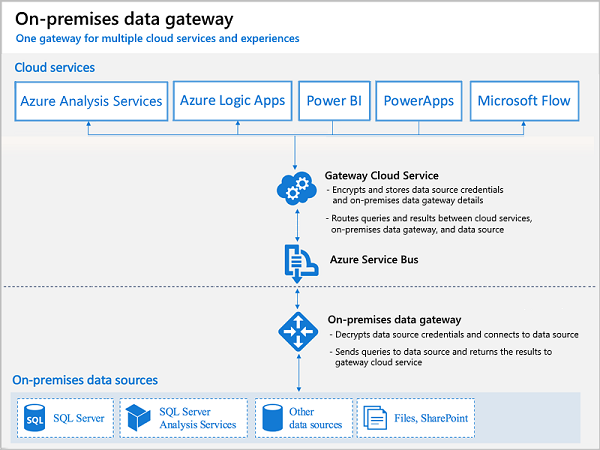

# Data Gateway Architecture and Build Documentation

## Table of Contents

- [Infrastructure Requirements](#infrastructure-requirements)
- [Network Architecture](#network-architecture)
- [Security Configuration](#security-configuration)
- [High Availability Design](#high-availability-design)
- [Performance Optimization](#performance-optimization)
- [Monitoring and Maintenance](#monitoring-and-maintenance)

## Infrastructure Requirements

The on-premises gateway allows Power Apps and Power Automate to reach back to on-premises resources to support hybrid integration scenarios. The gateway enables Azure Service Bus relay technology to securely allow access to on-premises resources.



### Server Specifications

#### Non Production Server Requirements (1 per non production network zone)

- **Operating System**: Windows Server 2022 Standard/Datacenter
- **Processor**: 8 CPU cores (3.0 GHz or higher)
- **Memory**: 16 GB RAM
- **Storage**: 100 GB SSD (Premium Storage recommended)
- **Network**: 1 Gbps NIC (optional - non produciton network bandwith sufficient)

#### Production Recommended Requirements ( Min 2 servers for redundancy)

- **Operating System**: Windows Server 2022 Datacenter
- **Processor**: 16 CPU cores (3.5 GHz or higher)
- **Memory**: 32 GB RAM
- **Storage**: 256 GB SSD (Premium Storage required)
- **Network**: 10 Gbps NIC (optional - production network bandwith sufficient)

### Software Prerequisites

- .NET Framework 4.8 or higher
- PowerShell 5.1 or higher
- TLS 1.2 or higher enabled
- Latest Windows Updates installed

## Network Architecture

### DMZ Configuration

```plaintext
[Internet] <-> [Azure Load Balancer] <-> [DMZ Gateway Servers] <-> [Internal Firewall] <-> [Backend Services]
```

### Network Segmentation

1. **External DMZ Segment**

   - Gateway servers
   - Reverse proxy servers
   - Load balancers
2. **Internal Services Segment**

   - SQL Server instances
   - Application servers
   - Domain controllers
3. **Management Segment**

   - Monitoring tools
   - Administrative access
   - Backup systems

### Firewall Rules

#### Inbound Rules

- TCP 443 (HTTPS) from Azure IP ranges
- TCP 9350-9354 for Gateway communication
- Management ports (RDP, WinRM) from admin networks only

#### Outbound Rules

- TCP 443 to Azure services
- SQL ports to backend databases
- DNS and NTP to internal services

## Security Configuration

### Identity and Access

- **Authentication**: Entra ID integration
- **Authorization**: Role-based access control (RBAC)
- **Service Accounts**: Managed Service Identities where possible

### Encryption and Certificates

- **Transport**: TLS 1.2+ required
- **Certificates**: Auto-renewed SSL certificates
- **Key Management**: Azure Key Vault integration

### Network Security

- IP restriction lists
- Network Security Groups (NSGs)
- Web Application Firewall (WAF)
- DDoS protection

## High Availability Design

### Gateway Clustering

- Minimum 2 gateway servers per environment
- Active-Active configuration
- Load-balanced endpoints

### Failover Configuration

```json
{
  "cluster": {
    "primaryNode": "gateway-prod-01",
    "secondaryNodes": [
      "gateway-prod-02",
      "gateway-prod-03"
    ],
    "heartbeatInterval": "30s",
    "failoverThreshold": "90s"
  }
}
```

## Performance Optimization

### Connection Pooling

```json
{
  "poolConfig": {
    "maxPoolSize": 100,
    "minPoolSize": 10,
    "connectionTimeout": "30s",
    "idleTimeout": "300s"
  }
}
```

### Caching Strategy

- Implement Redis Cache for frequently accessed data
- Cache invalidation policies
- Cache-Control headers configuration

## Monitoring and Maintenance

### Health Checks

- Gateway service status
- Connection metrics
- Performance counters
- Error logs

### Alerting Configuration

```json
{
  "alerts": {
    "cpuThreshold": 80,
    "memoryThreshold": 85,
    "responseTimeThreshold": "5s",
    "errorRateThreshold": 5
  }
}
```

### Backup and Recovery

- Regular configuration backups
- Gateway recovery procedures
- Disaster recovery planning

## Deployment Checklist

### Pre-Installation

- [ ] Verify server specifications
- [ ] Configure network segments
- [ ] Set up firewall rules
- [ ] Install prerequisites

### Installation

- [ ] Deploy gateway servers
- [ ] Configure clustering
- [ ] Set up monitoring
- [ ] Test connectivity

### Post-Installation

- [ ] Verify security settings
- [ ] Test failover
- [ ] Document configuration
- [ ] Train support staff
