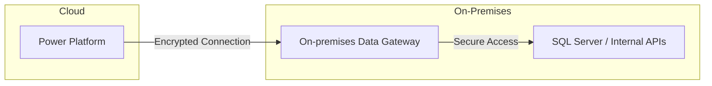
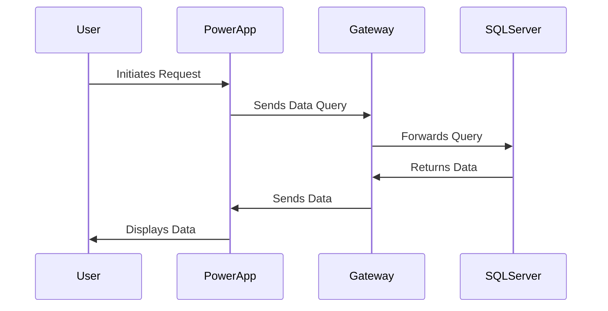
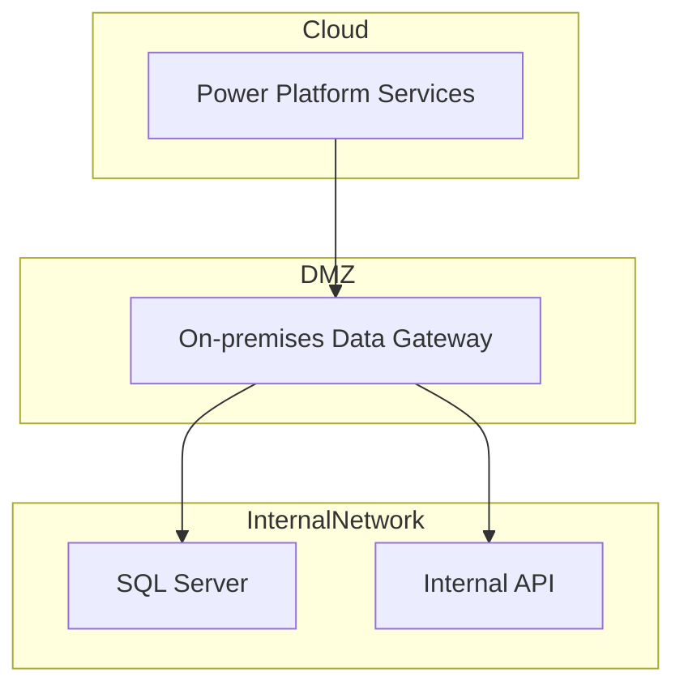

# Power Platform Integration with On-Premises Systems

Integrating Microsoft's Power Platform with on-premises systems through HTTP and SQL connectors offers organizations a robust solution for seamless data access and process automation. This integration is facilitated by the On-premises Data Gateway, which acts as a secure bridge between cloud services and on-premises data sources.

## Architecture Overview

The On-premises Data Gateway enables Power Platform applications—such as Power Apps, Power Automate, and Power BI—to securely connect to on-premises data sources, including SQL Server databases and internal APIs. This setup ensures that data remains within the organization's network, adhering to security and compliance requirements.

## Benefits of Integration

- **Enhanced Connectivity**: The gateway allows Power Platform applications to interact with on-premises data sources, facilitating real-time data access and updates.
- **Security Compliance**: Data transmission between cloud services and on-premises systems is encrypted, ensuring that sensitive information remains protected.
- **Operational Efficiency**: Automating workflows that involve on-premises data reduces manual intervention, leading to increased productivity.
- **Scalability**: Organizations can extend their existing on-premises infrastructure by integrating with cloud-based applications without overhauling their current systems.

## High-Level Architecture

## Data flow

## Network Architecture

## Additional Notes

These diagrams illustrate how the Power Platform interacts with on-premises data sources through the On-premises Data Gateway, ensuring secure and efficient data integration.
