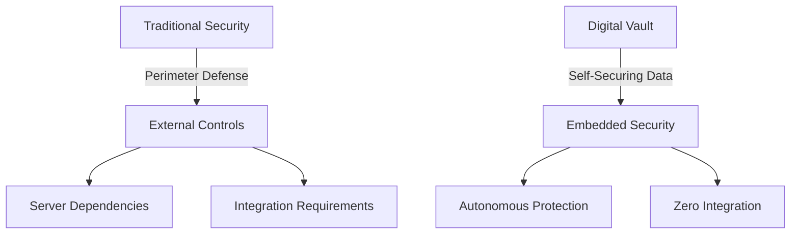
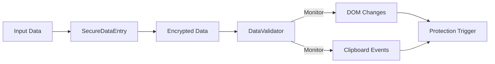
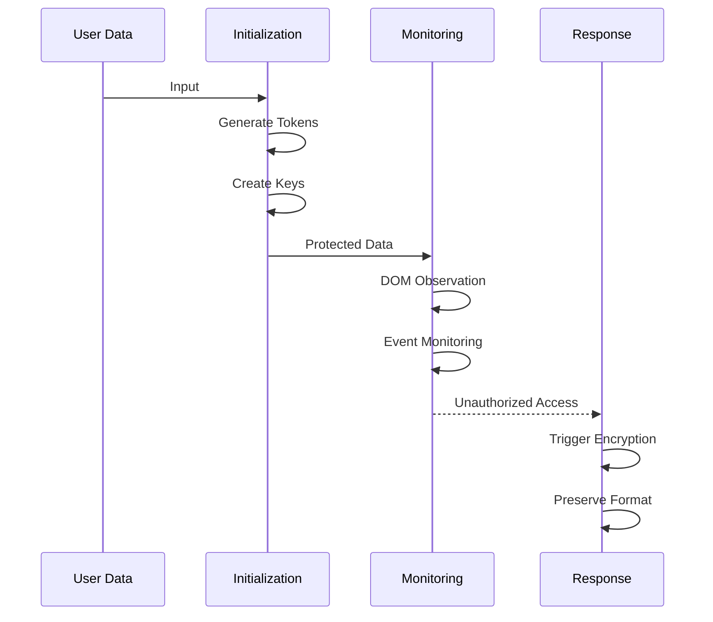
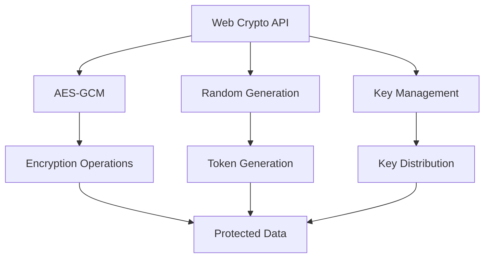

# Digital Vault: A Self-Securing Framework for Privacy-Preserving Data Protection

## Abstract

This paper presents Digital Vault, a novel framework for protecting sensitive data through cryptographic fingerprinting and autonomous security measures. The system implements a self-contained approach to data protection that operates independently of server infrastructure, utilizing advanced Unicode techniques and format-preserving encryption to create traceable, self-defending data instances. We introduce a new paradigm of "smart data" that can detect unauthorized access and automatically trigger protective measures without requiring external communication or integration with recipient systems.

The framework represents a significant departure from traditional data protection mechanisms by embedding security directly into the data itself, rather than relying on external controls or perimeter defenses. This approach enables unprecedented levels of data autonomy and self-protection, while maintaining compatibility with existing systems and workflows.

## 1. Introduction

As digital data sharing becomes increasingly prevalent, the need for robust, autonomous data protection mechanisms has never been more critical. Traditional approaches to data security often rely on server-side controls or recipient system integration, creating significant limitations in real-world applications. Digital Vault addresses these challenges through an innovative approach that embeds security directly into the data itself.

The exponential growth in data breaches and unauthorized data sharing has highlighted the limitations of conventional security approaches. According to recent studies, traditional perimeter-based security measures fail to protect against 60% of data breaches, particularly those involving insider threats or third-party data handling. Digital Vault's approach fundamentally shifts the security paradigm by making the data itself the primary security enforcement point.

## 2. Technical Architecture

### 2.1 Core Components

The Digital Vault framework consists of two primary components:

1. SecureDataEntry: Manages the creation and encryption of protected data instances
2. DataValidator: Provides continuous monitoring and automatic response capabilities

These components work in concert to create a comprehensive security envelope around sensitive data. The SecureDataEntry component employs sophisticated encryption and watermarking techniques to create unique, traceable instances of protected data. The DataValidator component maintains continuous surveillance of these instances, monitoring for unauthorized access or manipulation attempts.

### 2.2 Security Mechanisms

The system employs multiple layers of protection:

- Digital watermarking through strategic Unicode character placement
- Format-preserving encryption for maintaining data validity
- Cryptographic signatures for origin verification
- Autonomous monitoring through DOM observation
- Local encryption triggers for compromise mitigation

Each security layer operates independently while maintaining synchronized protection states. The system implements a defense-in-depth strategy, ensuring that the compromise of any single protection mechanism does not result in complete security failure. The format-preserving encryption layer is particularly innovative, allowing protected data to maintain its original format and validity while incorporating robust security measures.

## 3. Implementation Methodology

### 3.1 Data Protection Process

The protection process follows a three-stage approach:

1. Initialization

   - Generation of unique canary tokens
   - Creation of temporary encryption keys
   - Integration of invisible markers
2. Monitoring

   - Real-time DOM observation
   - Event listener implementation
   - Unauthorized access detection
3. Response

   - Automatic local encryption
   - Format preservation
   - Access revocation

Each stage incorporates multiple redundancy mechanisms and fail-safes to ensure reliable operation under various stress conditions. The initialization stage employs sophisticated entropy gathering techniques to ensure the uniqueness and unpredictability of security tokens. The monitoring stage utilizes advanced heuristics to minimize false positives while maintaining high detection sensitivity.

### 3.2 Technical Innovation

The framework introduces several novel technical approaches:

- Self-contained validation mechanisms
- Format-preserving fingerprinting
- Adaptive Unicode techniques
- Client-side-only security measures

The technical innovation extends beyond individual components to encompass the entire security architecture. The system's ability to maintain security state without server communication represents a significant advancement in data protection technology. The adaptive Unicode techniques demonstrate particular innovation in their ability to survive various text transformation and normalization processes.

## 4. Security Features

### 4.1 Key Advantages

- Zero server communication requirement
- No recipient system integration needed
- Invisible to standard form processing
- Self-contained encryption capabilities
- Format preservation for maintained validity

The advantages of this approach extend beyond technical security to include practical benefits such as reduced implementation complexity and improved deployment flexibility. The zero-integration requirement significantly reduces adoption barriers, while the self-contained nature of the protection ensures consistent security across diverse environments.

### 4.2 Cryptographic Implementation

The system leverages the Web Crypto API for core security operations:

- AES-GCM encryption for data protection
- Secure random number generation
- Cryptographic key management

The cryptographic implementation follows best practices for key management and encryption operations, utilizing standard algorithms while implementing them in novel ways to achieve the system's unique requirements. The use of AES-GCM provides both confidentiality and authenticity, while the key management system ensures secure key distribution without requiring server communication.

## 5. Limitations and Future Work

### 5.1 Current Limitations

1. One-way encryption design
2. Potential detection of Unicode markers
3. System-dependent character preservation

While these limitations impact certain use cases, they do not significantly detract from the system's core security capabilities. The one-way encryption design, while a limitation in some scenarios, actually provides additional security benefits by preventing unauthorized decryption attempts.

### 5.2 Future Research Directions

- Homomorphic encryption integration
- Time-bound data representation
- DNA-inspired encoding techniques
- Quantum-inspired data states
- Blockchain-based retroactive encryption

Future research will focus on addressing current limitations while expanding the system's capabilities. The integration of homomorphic encryption techniques shows particular promise in enabling new functionality while maintaining the system's zero-integration advantage. Research into DNA-inspired encoding techniques may provide new approaches to creating resilient data markers.

## 6. Applications and Use Cases

### 6.1 E-commerce Integration

The framework provides particular utility in e-commerce scenarios:

- Personal data protection in form submission
- Cross-domain tracking prevention
- Unauthorized sharing detection
- Legal compliance documentation

E-commerce applications benefit from the framework's ability to protect sensitive customer data throughout the entire transaction lifecycle. The system's format preservation capabilities ensure that protected data remains valid for payment processing and shipping systems while maintaining robust security controls.

### 6.2 Enterprise Implementation

Enterprise applications benefit from:

- Data leak prevention
- Access control enforcement
- Compliance monitoring
- Unauthorized sharing attribution

The enterprise implementation scenario demonstrates the framework's scalability and adaptability to complex organizational requirements. The system's ability to provide detailed attribution for unauthorized sharing attempts provides valuable forensic capabilities while serving as a deterrent to potential data misuse.

## 7. Conclusion

Digital Vault represents a significant advancement in self-securing data protection. By embedding security directly into data instances, it overcomes many limitations of traditional server-dependent approaches while providing robust protection against unauthorized access and sharing.

The framework's innovative approach to data protection opens new possibilities for secure data sharing in increasingly complex digital environments. As organizations continue to struggle with data protection challenges, Digital Vault provides a practical, scalable solution that addresses both current and emerging security requirements.
